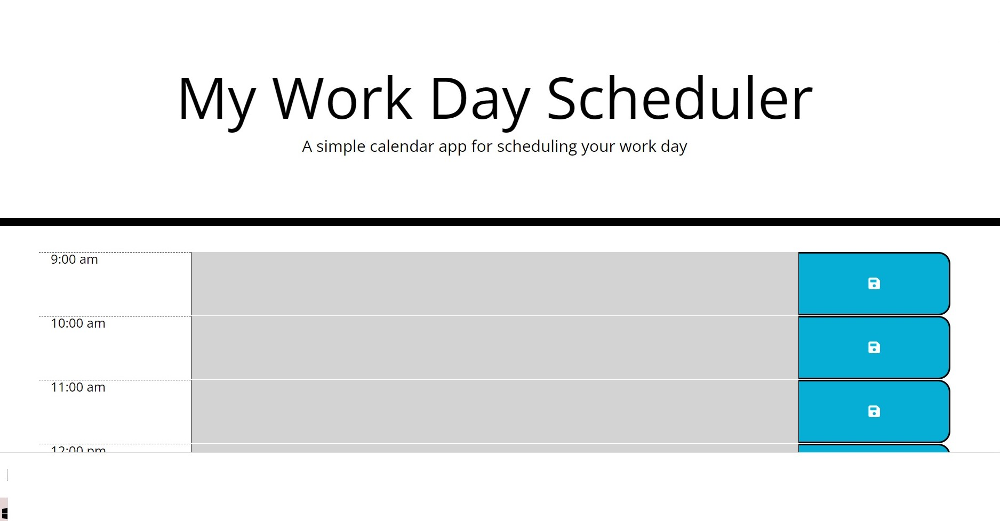

# Third-Party APIs: Work Day Scheduler

## User Story

```md
AS AN employee with a busy schedule
I WANT to add important events to a daily planner
SO THAT I can manage my time effectively
```
## Description
When the user opens the planner, the current day is displayed at the top of the calendar.
When the user scrolls down, they are presented with timeblocks for standard business hours.
Each timeblock is color-coded to indicate whether it is in the past, present, or future.
When the user clicks into a timeblock, they can write a task and then save it when the save button is clicked. 
The task is then saved locally. When the user refreshes the page, the saved events persist.

## Usage
To use the workday scheduler, simply open the deployed page in your browser. The current date and time will be displayed at the top of the page. Scroll down to view the timeblocks for the standard business hours of 9AM to 5PM. Each timeblock is color-coded to indicate whether it is in the past (grey), present (red), or future (green). To add your task, simply click on the text area for the corresponding timeblock and enter it. To save your event, click the save button for that timeblock. 

## Screenshot


## Technologies Used
This project was created using HTML, CSS, and JavaScript. The following libraries were used:

Bootstrap
jQuery
Moment.js

## Credits

This project was created by  *Inna*.